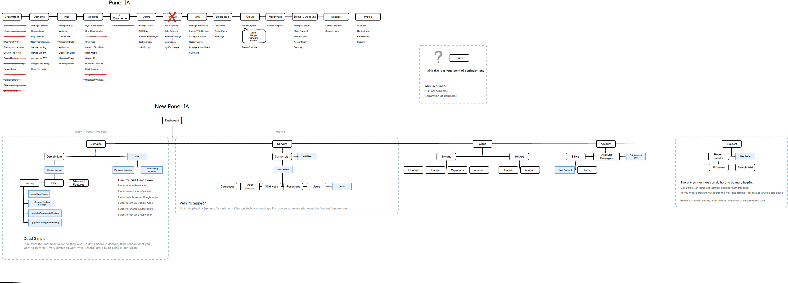
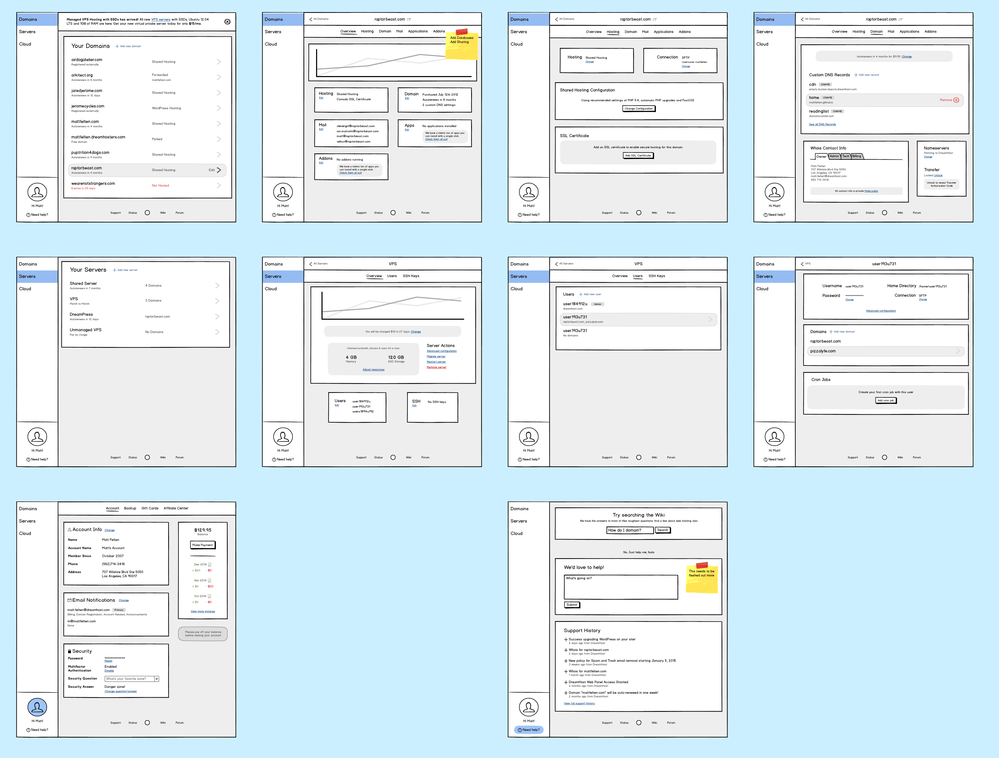
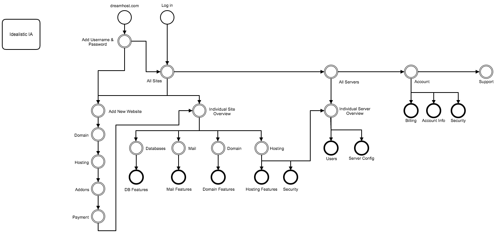
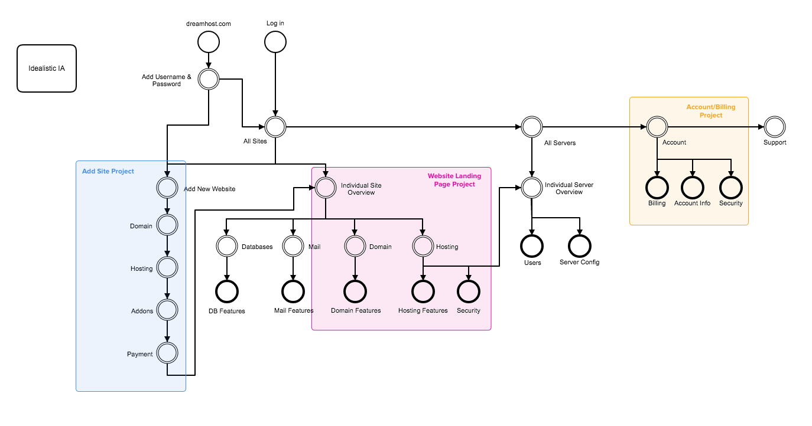
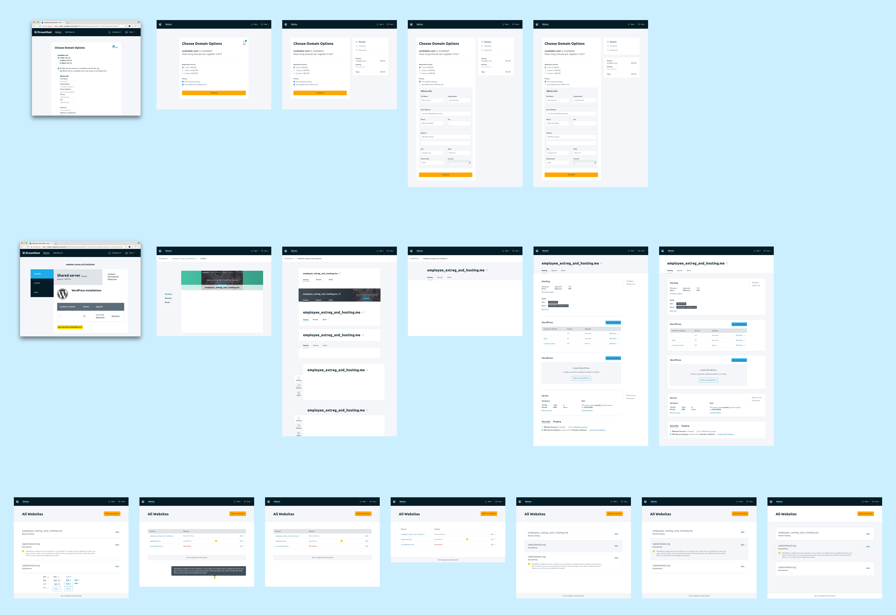
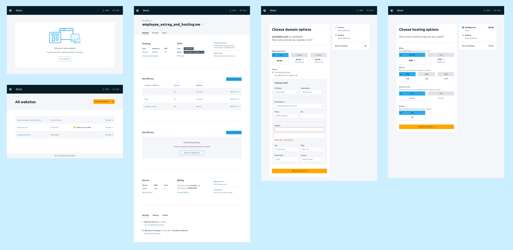

DreamHost been around for 19 years and the interface powering the service had been built organically over the years. The application was structured to be incredibly flat, so every feature required a new page and a new menu item. This makes sense for services that do a few things really well. After years of new features to the platform, the navigation grew to upwards of 20 menu items.

The product & design teams struggled with providing new features that users were able to find intuitively. We had categories to the navigation but it was still upwards of 20 items no matter what way you grouped it, and each new feature added one more.

Moreover, talking to users about the application, they also had issues knowing about features. A very few power users were using the platform daily to monthly. A majority of users would sign in infrequently, when services need renewing or upgrading, and have to learn our interface each time. We also user tested our interface and found that a big barrier to entry was not knowing what most of the menu items were for. It would take trial and error clicking around to find the features they were looking for.

- **Pain Point:** Designers have trouble adding new features in an intuitive way besides adding another feature to the list.
- **Pain Point:** Users have trouble knowing about new features, as well as finding existing features they already used.

A very common workflow for us was WordPress hosting. WordPress powers over a quarter of the websites on the entire internet, so people running WordPress websites and blogs were in our target demographic.

The workflow to set up a new WordPress site was complicated.
- Find domain registration
- Find an available domain (the URL you're thinking of is for sure already taken)
- Buy domain
- Find hosting section
- Add the domain to one of your existing hosting services (if you don't have a hosting service you have to find the area to add that as well)
- Find the application installation section
- Find WordPress and click button to install

None of this was explained outside of help articles. Through user testing and looking at analytics, we were losing people in these steps. If we were lucky, they would contact support and get help. Many were not.

- **Pain Point:** Flat structure imposed a very convoluted user workflow. People were having trouble completing all the steps.

## Problem Statements
{: .section-title.mt6 }

There were two big issues this unveiled that we wanted to solve.

- **Problem:** How can we make managing the features of your account easier to find?
- **Problem:** How can we improve the workflow for adding a website to improve success?

## Where to Start
{: .section-title.mt6 }

I got the design team together to start brainstorming some ideas. A lot of the concepts behind these problems were things we have talked about for years so we definitely already had a trove of ideas to try. The one we felt the most confident in was reorganizing the interface around websites, instead of services.

The majority case of users on the platform were hosting websites. They were combining services in order to make a website, and we had it organized around the services, not the end goal.

If we used the website as the top level heirarchy, all the services could live underneath. We could organize the experience so you had your websites listed up front and clicking through could send you to a dashboard giving you more information about the services in use and ways to change and add more. That could solve **Problem 1** because it would orient the user around something they already know, their website.

If we did that, we could also try out experimenting with a single user flow that let users create a website. All the steps needed and some extras like installing WordPress. That could solve **Problem 2** by being a one-stop-shop to get going.

We quickly put together a rough wireframe prototype to user test. We tested these ideas against an equally rough version of our current interface for comparison purposes. Testing showed that significantly more users were able to find services using the new concept and new users were able to create a website without needing additional knowledge about what they were setting up.

We learned a ton too. The prototype was rough so we only had the features we thought were necessary to complete the flow. We made a list of the features users asked about, things like "Where can I set how long I want to buy the domain for?" and prioritize adding them as well.

## Information Architecture
{: .section-title.mt6 }

Because the prototype tested so well, we moved forward fleshing out what the entire application would be like under this new paradigm. It took a lot of research, documenting all our services, and iterating but we got it contained into a four sections.
- Websites
- Servers
- Account
- Support

All the features we offered supported one or more of those categories. So those became our top-level concepts.

## MVP
{: .section-title.mt6 }

Add Website, Website Management, Billing Information

After iterating on the information architecture for a few cycles with the design team and stakeholders we got to a place where we had a good idea where most of the feature would fall within the application. Still, with building an application from the ground up, especially one of this size, we needed to pair down what we would create first.

We had three other designers working on the project at this time, so I divided it up into three distinct sections.

The **Add Website Flow** was the main way we decided users could get from nothing to having a website in one stop. We wanted this in the MVP because it was a core idea of the new application and there was a ton of opportunity to get it in front of users and refine the experience and the features offered.

The **Website Landing Page** section was the main method of managing the websites that a user already had set up. This was where most of the information and services we offered would live. This was also core to the idea of the new application. This section is really what tied our services together and be easier to find.

The **Account Section** would contain user preferences and billing information. We decided to focus on this for the MVP because based on analytics, we had a lot of usage from users paying their monthly bill. Adding to the MVP would make the users have to switch back to the existing application at lot less.

## Design, Prototype, Test
{: .section-title.mt6 }

The previous round of user testing was to validate we had a valid concept for our hypothesis. This phase is where the normal design process took place.

Each designer at this point worked on their respective projects from the diagram above. I went into a product manager role, making sure each project had the right project specs for the designers, made sure we were asking and answering the right questions while user testing, and that all three projects would stitch back together in a cohesive application.

I also spent time wireframing the dashboard, the first screen you land on when you logged into the application. We also decided we wanted to have a coded prototype we could use to test and hand off to engineering, so I build the groundwork for that using [Vue.js](https://vuejs.org).

## Visual Exploration
{: .section-title.mt6 }

We cycled through a lot of iterations on wireframes with the team. We had a rough prototype of our application that was testing well with users. The biggest issue we had was there were four of us working on the application and it definitely looked like it. Each section of the app had a distinct look and feel to it. The app looked miles away from where the original app was but it still had a fair amount of inconsistencies.

Some of the other designers had to move on to other projects so there were only two of us at this point. I led that designer through an exercise to establish a consistent look and feel across the entire application collaboratively.

Designing every page in the application as a pixel-perfect high resolution mockup in Sketch would take a really long time. I looked across our prototype and took five core pages that had unique layouts and features. I decided that if we spent time designing those five screens, we could use them as the goalposts for the look and feel for the entire application.

- **Website Dashboard** This would be the first screen you would see when you entered the application. It was a standard list screen showing all the websites you had set up.
- **Blank Slate** This was the screen that would appear if you signed in and did not have any websites set up. I wanted to make sure we were keeping these states in mind and had a consistent way of displaying them.
- **Manage Website** This was the screen a user would see when they chose a website they wanted to modify. It was a combination of a dashboard and way to find, add, and change services on the website. It gave us an idea of how to display a lot of complicated information in an organized way.
- **Add Website - Contact Info** This screen is a form-heavy layout with a lot of text inputs for customers to put in their information. This let us figure out a reusable form design that can scale across any other form screens.
- **Add Website - Hosting Options** This screen is also a form layout but it is geared more towards selecting options and not inputting data. This helped us flesh out our form design.

We cycled on these screens about three times. Each time we would present our ideas to each other and bring in more of the design team for feedback on open questions. I would take our designs and combined them into a presentation and gather feedback from stakeholders. After the third iteration, we felt confident in our visual identity for this app and decided to move forward with it. Below is the final iteration.

## Rework Prototype & Handoff
{: .section-title.mt6 }

So now we have a working prototype of the application that has been user tested and we have a set of screens we are using for goalpost visual design. The next and final step was to update our prototype so that every screen fit in with that visual design. One designer and myself spent about two weeks updating our prototype to match.

Our handoff to leadership and engineering because a presentation of the final UI design as well as a coded prototype. The coded front-end we created became the groundwork for a design system that would let us continue building out the application in a maintainable and consistent fashion.

This project was an incredible amount of work, with the entire design team working together with leadership, product management, engineering, and tech support. We were able to create an MVP of a reimagined application through a user-first design process, built in code for our engineering team, and validated to prove our hypothesis'. We created an updated visual language for the company, a design system, and an application that can scale to future product features.

I was able to use all of my product design, user experience, front-end development, project and product management skills together in a single project to provide clarity on a problem that was seen as unsolvable. I was also able to foster a collaborative work environment for designers all working on one really large project. This was one of the most ambitions projects I've worked on and I'm incredibly proud with what we accomplished.

[See more of my work at DreamHost](../)
